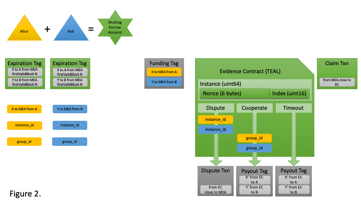

# Payment Channel Tutorial

This is an example payment channel implementation using TEAL on the Algorand network. It allows two (2) accounts to establish and fund an on-chain multisig account then perform off-line state updates in a series of evidence contracts which represent revocable TEAL programs defining on-chain settlement of the escrowed assets to accounts. Payment channels are best known as the primitive used to hold funds in the Bitcoin Lightning Network. 

TAGS: [ payment channel ] [ layer two ] [ multisig ] [ goal ] [ algokey ] [ bash ] [ TEAL ] [ tealsign ] [ ed25519verify ] [ bitwise and ]

## Example Scenario

Alice and Bob intend to form a payment channel to escrow some Algos on-chain, then perform a series off-chain balance updates, and finally settle the most recent balance state to their respective accounts sometime in the future. Figure 1. illustrates the workflow Alice and Bob will perform. 

`TODO: Insert Workflow Image`

Figure 2. below provides a visual representation of the components used in the payment channel tutorial. Colors and shapes are important to understand meaning. 



### Shapes

- _Accounts_ are represented with the triangle (one each for Alice and Bob)
- _Multisig Escrow Account_ is represented with a star shape
- _Transactions_ are represented with rectangles
- _Transaction Group_ is represented with a square (multiple transactions represented within)
- _Evidence Contracts_ (TEAL programs) are represented with a clipped corner rectangle
- _TEAL Clauses_ are represented by rectangle with an arrow
  - Required _arguments_ are represented on the arrow path
  - The arrow points to an unsigned transaction representing the _LogicSig_
- _Arguments_ (base64 data) passed with a transaction are represented with rounded corner rectangles

### Colors

Color is used to represent which entity signed the element

- Alice is yellow
- Bob is blue
- Multisig Escrow Account is green 
- Grey represents unsigned 

## Solution Overview

There are four (4) phases in the payment channel protocol: Initialization, Funding, Off-Chain State Updates and On-Chain Settlement.

### 1. INITIALIZATION

The initialization phase establishes a multisig account for two parties to escrow their initial funds within. This phase has two components: establishing the multisig escrow account and signing an expiration transaction group.

#### MULTISIG ESCROW ACCOUNT

Alice and Bob must cooperate to form a multisig account to escrow funds within and pay fees from. 

#### EXPIRATION TRANSACTION GROUP

Both parties agree how much to fund the multisig escrow account with and how long the payment channel should remain open for. This requires they negotiate, create and sign an Expiration Transaction group as a safety measure against griefing. Both Alice and Bob must retain this signed Expiration Transaction until the payment channel is closed cooperatively, else they may broadcast it after expiration to retrieve their initial funds from the multisig escrow account. 

### 2. FUNDING

Both Alice and Bob will now cooperate to create, sign and broadcast a Funding Transaction group. This will fund the multisig account with initial amounts from both parties simaltaniously because the transactions are grouped, which means they will all succeed or all fail. 

### 3. OFF-CHAIN STATE UPDATES

Here is where the exciting bits happen, off-chain. Each state change results in two (2) output files: a Claim Transaction (mSig Tx) and an Evidence Contract (TEAL Logic Sig). Many updates may be negotiated by Alice and Bob and held off-line. Both parties need only retain the most recent Claim Transaction and Evidence Contract, as each subsequent update will nullify any previously generated states. 

#### CLAIM TRANSACTION

The Claim Transaction liquidates the assets within the multisig escrow account into a new escrow account which is enforced by a TEAL program called an Evidence Contract.  

#### EVIDENCE CONTRACT

The Evidence Contract is LogicSig escrow account representing the most recent payment channel state. Each evidence contract contains a static nonce (48-bits) and an incrementing index (uint16). These values guarantee unique addresses per state and are used with signature verification during evidence evaluation. Each evidence contract is comprised of three (3) clauses: Dispute, Cooperate and Timeout. 

##### DISPUTE

The Dispute clause is used to present evidence that a more recent payment channel exists and will send the assets back to the multisig escrow account. The TEAL code evaluates the evidence (signed data) against values defined in the evidence contract.

##### COOPERATE

The Cooperate clause approves a transaction sending assets to both Alice and Bob at the agreed upon amounts defined within TEAL code.

##### TIMEOUT

The Timeout clause approves a transaction group sending assets to both Alice and Bob at the agreed upon amounts after a timeout block height defined within TEAL code. This protects both parties against the other party failing to cooperate, allowing assets to be sent after the timeout.

### 4. ON-CHAIN SETTLEMENT

The final step in the payment channel protocol is settling the assets to accounts using the most recent state. This may be achieved with a single cooperative transaction which liquidates the multisig escrow account. To fully demonstrate the payment channel updates, the remainder of the tutorial will walk through settlement using the Evidence Contract.

## TUTORIAL WALKTHROUGH

Next is a walkthrough which demonstrates the Example Scenario using the same flow from Solution Overview.

### 0. WALLET AND ACCOUNT SETUP

As a prerequisite, both parties must configure their account and wallet on the same network. This tutorial targets the TestNet because a faucet is provided to fund new test accounts. Normally each party will already have an available wallet with an account. However, for simplicity this tutorial demonstrates the creation of a single new wallet which will hold both accounts. 

First, use `goal` to create a new wallet named "pc tutorial":

`goal wallet new "pc tutorial" -d $DATA`

Next, use `algokey` to generate two new accounts for ACCOUNT_A and ACCOUNT_B:

```
mkdir -p keys
export ACCOUNT_A=$(algokey generate -f keys/ACCOUNT_A | tail -1 | awk '{ print $3 }')
export ACCOUNT_B=$(algokey generate -f keys/ACCOUNT_B | tail -1 | awk '{ print $3 }')
```

Notice a keyfile is created for each account which contains the private key. Keep these files secured offline for future use during the signing process.

These new accounts must be imported into a wallet using the 25-word mnemonic encoded within each keyfile. Use `algokey` to export mnemonic string for each accounts:

`export ACCOUNT_A_MNEMONIC=$(algokey export -f keys/ACCOUNT_A | head -n1 | awk 'BEGIN{FS=":"} { print $2 }')`
`export ACCOUNT_B_MNEMONIC=$(algokey export -f keys/ACCOUNT_B | head -n1 | awk 'BEGIN{FS=":"} { print $2 }')`

Next, import the accounts into the new wallet using `goal` by providing the above mnemonic string and the wallet name within double quotes: 

`goal account import --mnemonic "$ACCOUNT_A_MNEMONIC" --wallet "pc tutorial" -d $DATA`
`goal account import --mnemonic "$ACCOUNT_B_MNEMONIC" --wallet "pc tutorial" -d $DATA`

Verify both accounts are properly imported using `goal`:
`goal account list --wallet "pc tutorial" -d $DATA`

All new accounts have a 0 Algo balance. Algorand provide a [TestNet faucet](https://bank.testnet.algorand.network/) to top up your new accounts. Just follow the link, paste in the account address and click the "Dispense" button to get some TEST Algos.

### 1. INITIALIZATION

The initialization phase establishes a multisig account for two parties to escrow their initial funds within. This phase has two components: establishing the multisig escrow account and signing an expiration transaction group.

### MULTISIG ESCROW ACCOUNT

First, Alice and Bob must cooperate to form a multisig escrow account to escrow funds within and pay fees from. Use `goal` to generate their multisig account:

`goal account multisig new $ACCOUNT_A $ACCOUNT_B --threshold 2 --wallet "pc tutorial" -d $DATA`

Verify the [2/2 multisig] account was created properly using `goal`:

`goal account list --wallet "pc tutorial" -d $DATA`

TODO: export to $TMPL_ACCOUNT_MSIG

Alice and Bob now have an account they jointly own. Any funds within this account may only be moved by a transaction signed by both parties.

### EXPIRATION TRANSACTION GROUP

Referring to Figure 2. the expiration transaction group contains two transaction. Recall, this transaction group is intended to be held offline by both parties as a safeguard against the other party griefing them. There are two elements to the transactions that must be agreed to by both Alice and Bob: Initial Funding Amount and Expiration.

#### Initial Funding Amount

Alice and Bob will agree on the initial funding amount. Typically, this is the same value for both parties, but it may be different. Set the value in microAlgos as appropriate:

`export AMOUNT_INITIAL=200000`

#### Expiration

Alice and Bob must also agree on the expiration time for their payment channel. This is defined as the first valid block their expiration transaction group will be accepted by network consensus. Use `goal node status -d $DATA` to find the current _Last committed block_ value. Choose a reasonable block height in the future:

`export EXPIRATION_BLOCK_HEIGHT=2800000`

`TODO: export to $LAST_COMMITTED_BLOCK and set EXPIRATION_BLOCK_HEIGHT=$LAST_COMMITTED_BLOCK+36 # about 3 minutes in the future`

#### Create the Expiration Transaction Group

The Expiration Transaction is a signed grouped transaction comprised of two unsigned transactions, each sending the initial amount from the multisig account back to the respective funding accounts. Either party may generate and group the unsigned transactions using `goal`:

`goal clerk send -a $AMOUNT_INITIAL -f TMPL_ACCOUNT_MSIG -t $ACCOUNT_A --firstvalid $EXPIRATION_BLOCK_HEIGHT -o expiration_a.utx -d $DATA`
`goal clerk send -a $AMOUNT_INITIAL -f TMPL_ACCOUNT_MSIG -t $ACCOUNT_B --firstvalid $EXPIRATION_BLOCK_HEIGHT -o expiration_b.utx -d $DATA`
`cat expiration_a.utx expiration_b.utx > expiration.utxc`
`goal clerk group -i expiration.utxc -o expiration.utxg`

The two unsigned transactions are now grouped with the same identifier. Alice and Bob will exchange this file, ensure the contents meet the agreed to terms, and then sign their respective transaction using `goal`:

`goal clerk inspect expiration.utxg`
`goal clerk multisig sign --tx expiration.utxg --address $ACCOUNT_A --wallet "pc tutorial" -d $DATA`
`goal clerk multisig sign --tx expiration.utxg --address $ACCOUNT_B --wallet "pc tutorial" -d $DATA`
`goal clerk inspect expiration.utxg`

Notice the elements for "pk" and "s" are added to the "msig" section within the transaction. Notice also that the `goal clerk multisig sign` command overwrites the transaction file, so Alice may sign and send their partially signed transaction to Bob and await the return of the fully signed transaction.

Once both Alice and Bob possess a properly signed Expiration Transaction Group, they each will have confidence in funding their multisig escrow account. Both Alice and Bob must retain this signed transaction offline until the payment channel is closed or either party may broadcast it after expiration to retrieve their initial funds. 

## 2.  FUNDING

Both Alice and Bob will now cooperate to create, sign and broadcast a Funding Transaction group. This will fund the multisig escrow account with initial amounts from both parties simultaneously because the transactions are grouped, which means they will all succeed or all fail. Use `goal` to create the transactions and group them:

`goal clerk send -a $AMOUNT_INITIAL -f $ACCOUNT_A -t TMPL_ACCOUNT_MSIG -o funding_a.utx --wallet "pc tutorial" -d $DATA`
`goal clerk send -a $AMOUNT_INITIAL -f $ACCOUNT_B -t TMPL_ACCOUNT_MSIG -o funding_b.utx --wallet "pc tutorial" -d $DATA`
`cat funding_a.utx funding_b.utx > funding.utxc`
`goal clerk group -i funding.utxc -o funding.utxg`

Alice and Bob must sign their respective transaction and combine it with the other signed transaction to form the transaction group. First, the grouped transaction must be split, then each signed by the proper account and those signed transactions concatenated:

`goal clerk split -i funding.utxg -o funding.utxg`
`goal clerk sign -i funding-0.utxg -o funding-0.stxg --wallet "pc tutorial" -d $DATA`
`goal clerk sign -i funding-1.utxg -o funding-1.stxg --wallet "pc tutorial" -d $DATA`
`cat funding-0.stxg funding-1.stxg > funding.stxgc`
`goal clerk inspect expiration.utxg`

Notice both signed transactions have the same "group_id". This Funding Transaction Group may now be broadcast by either party using `goal`:

`goal clerk rawsend -f funding.stxgc -d $DATA`

The multisig escrow account is now funded with the initial amounts from both parties. Use `goal` to view the updated account balances:

`goal account list -w "pc tutorial" -d $DATA`

## CONSTRUCTING THE FIRST EVIDENCE CONTRACT AND CLAIM TRANSACTION

Alice and Bob are ready to perform some off-chain updates. Each update is represented by two elements: Evidence Contract and Claim Transaction. 

### Claim Transaction

The Claim Transaction is quite simple, it liquidates all assets within the Multisig Escrow Account to a specific Evidence Contract. Recall from Figure 2. that the Claim Transaction is colored green representing it is signed by the multisig account. Alice and Bob must cooperate to create and sign the Claim Transaction. However, they must first create the Evidence Contract, as once it is compiled will define the account the Claim Transaction will send to.

### Evidence Contract

The Evidence Contract is a TEAL program LogicSig account. This is special kind of escrow account which contains three clauses and will only approve a transaction for the account if one of the clauses evaluates to TRUE. Refer to Figure 2. to see the elements of the Evidence Contract.

#### Clauses

There are three clauses, each representing evaluation criteria an associated spending transaction must provide to be approved. Examples of each are provided later in this tutorial.

#### Identifiers

The Evidence Contract has four identifiers: Initializer, Instance, Nonce and Index. These values are embedded within the TEAL code and used by the Clauses for evaluation. 

The Initializer and the Instance are both uint64 elements comprised of concatenating two other data elements. The Initializer concats a 6-byte Nonce with a 2-byte padding. This value is static and embedded into each Evidence Contract Alice and Bob create. The Instance concats the same Nonce with an Index value that increments each time a new Evidence Contract is created. 

### Initialize the First Evidence Contract

Before Alice and Bob may create their first Evidence Contract together they need to cooperatively initialize their payment channel. The first step is defining the contract Nonce using `OpenSSL` to generate 6 bytes of randomness:

`CONTRACT_NONCE_HEX=$(printf $(openssl rand -hex 6) | awk '{ print toupper($0) }')`

The second step appends 2 bytes of padding:

`CONTRACT_INITIALIZER_HEX=$CONTRACT_NONCE_HEX"0000"`

The final step converts the hex value to uint64 for use as the Initializer value within the TEAL template later:
`TMPL_CONTRACT_INITIALIZER_UINT64=$(echo "obase=10; ibase=16; $CONTRACT_INITIALIZER_HEX" | bc)`

The initializer value will remain static for all evidence contracts Alice and Bob create using this multisig escrow account. 

### Create the First Evidence Contract

Recall Alice and Bob each sent 200,000 microAlgos to the multisig escrow account, so the current balance is 400,000 microAlgos and both hold an expiration transaction.

Alice intend to send 50,000 microAlgos to Bob by updating balances within a new payment channel state. The results will be balances reflecting Alice will receive 150,000 and Bob 250,000 at closing. 

Construction of the Evidence Contract requires defining Identifier values and the terms for each Clause.

#### Define the Contract Index

Each evidence contract is indexed to ensure the most recent (highest index value) is the only valid representation of the current payment channel state. The contract index is a unint16 value, typically starting at 1. 

`TMPL_CONTRACT_INDEX_INT=1`

#### Define the Contract Instance

The last piece of required data is the contract instance which is a unit64 value representing an 8-byte word. It is the concatination of the 6-byte contract nonce and the uint16 index value defined above. The contract instance will be passed as an argument with a transaction, so it must be converted to base64. 

First, convert the contract index to uint16:

`CONTRACT_INDEX_HEX=$(printf "%04X" $TMPL_CONTRACT_INDEX_INT)`

Next, concatenate the Nonce and Index:

`CONTRACT_INSTANCE_HEX=$(echo $CONTRACT_NONCE_HEX$CONTRACT_INDEX_HEX)`

Next, wirte the contract instance to a file which will be signed later.

`printf "%s\n" "0x$CONTRACT_INSTANCE_HEX" | xxd -r -p > contract_$CONTRACT_INSTANCE_HEX.dat`

Last, convert the contract index value to Base64 so it may be passed as a transaction argument later.

`ARG_BASE64_CONTRACT_ID_CONCAT_INDEX=$(base64 contract_$CONTRACT_INSTANCE_HEX.dat)`

#### Define the Instance Evaluation Clause

It's time to write some TEAL! The first clause will evaluate if both Alice and Bob signed an instance identifier matching this Evidence Contract. 

Create a new file `payment_channel.teal` and replace the $TMPL_ values as defined above.

TODO: use `cat` and `sed` to write this file and replace the template values similar to the other template examples.

```
// Instance Evaluation - TMPL_ACCOUNT_A
arg 0                                 // DATA: ARG_CONTRACT_INSTANCE_BASE64
arg 1                                 // SIGNATURE: ACCOUNT_A signing provided by tealsign
addr $TMPL_ACCOUNT_A                  // PUBKEY: $TMPL_ACCOUNT_A
ed25519verify                         // Verify signature

arg 0                                 // Load arg_0 ($ARG_BASE64_CONTRACT_ID_CONCAT_INDEX)
btoi                                  // Convert bytes to int
int 18446744073709486080              // Define the mask as 0xFFFFFFFFFFFF0000
&                                     // Evaluate by masking off the last 2 bytes
int TMPL_CONTRACT_INITIALIZER_UINT64  // Define the $TMPL_CONTRACT_INITIALIZER_UINT64 for the payment channel
==                                    // Evaluate contract initializer for equality

arg 0                                 // Load arg_0 (ARG_BASE64_CONTRACT_ID_CONCAT_INDEX)
btoi                                  // Convert bytes to int
int 65535                             // Define the mask as 0x000000000000FFFF
&                                     // Evaluate by masking off the first 6 bytes
int $TMPL_CONTRACT_INDEX_INT          // Define $TMPL_INT_CONTRACT_INDEX for this evidence contract instance
>                                     // Evaluate contract index passed as arg_0 > $TMPL_INT_CONTRACT_INDEX 
&&                                    // and evaluations: index AND initializer
&&                                    // and evaluations: (index and initializer) AND signature verification

// Instance Evaluation - TMPL_ACCOUNT_B
arg 0                                 // DATA: ARG_CONTRACT_INSTANCE_BASE64
arg 2                                 // SIGNATURE: ACCOUNT_A signing provided by tealsign
addr $TMPL_ACCOUNT_B                  // PUBKEY: $TMPL_ACCOUNT_B
ed25519verify                         // Verify signature

arg 0                                 // Load arg_0 ($ARG_BASE64_CONTRACT_ID_CONCAT_INDEX)
btoi                                  // Convert bytes to int
int 18446744073709486080              // Define the mask as 0xFFFFFFFFFFFF0000
&                                     // Evaluate by masking off the last 2 bytes
int TMPL_CONTRACT_INITIALIZER_UINT64  // Define the $TMPL_CONTRACT_INITIALIZER_UINT64 for the payment channel
==                                    // Evaluate contract initializer for equality

arg 0                                 // Load arg_0 (ARG_BASE64_CONTRACT_ID_CONCAT_INDEX)
btoi                                  // Convert bytes to int
int 65535                             // Define the mask as 0x000000000000FFFF
&                                     // Evaluate by masking off the first 6 bytes
int $TMPL_CONTRACT_INDEX_INT          // Define $TMPL_INT_CONTRACT_INDEX for this evidence contract instance
>                                     // Evaluate contract index passed as arg_0 > $TMPL_INT_CONTRACT_INDEX
&&                                    // and evaluations: index AND initializer
&&                                    // and evaluations: (index and initializer) AND signature verification

// Instance Evaluation - Both TMPL_ACCOUNT_A and TMPL_ACCOUNT_B
+                                     // Sum signature evaluation results of TMPL_ACCOUNT_A and TMPL_ACCOUNT_B
int 2                                 // Load integer value 2
==                                    // Ensure both TMPL_ACCOUNT_A and TMPL_ACCOUNT_B signed arg_0

```

#### Define the Timeout Clause

The Timeout clause allows both parties to receive their assets from the most recent evidence contract account after a defined timeout period passes. 

`export TMPL_FIRST_VALID=2800000`

TODO: refactor TEAL checks

```
// TIMEOUT CLAUSE
// Check payout transactions both have FirstValid values > $TMPL_FIRST_VALID

// TEAL does not know the current block height. Approving the transaction with the LogicSig will not ensure it is accepted by network. It may be rejected it presented prior to the actual block height.

group2:
// Verify the transaction group defines the payout transaction matching the intended state.
// Check the first transaction
gtxn 0 Sender
addr JOMB6LWMHAE5IL5TVTIWWBBMUADAVSBGKYGOXEGO64FNVE7WLV2M64WKGM  // $TMPL_ACCOUNT_MSIG
==
gtxn 0 Receiver
addr LMDXDC2RDETFQAJ5SRLFPXWO7AFKG5E3UFUGNOSRPIUA3JPQPQZUI773IU  // $TMPL_ACCOUNT_A
==
&& // Sender AND Receiver
gtxn 0 Amount
int 150000 // $TMPL_AMOUNT_A
==
&& // AND Amount
gtxn 0 CloseRemainderTo
addr LMDXDC2RDETFQAJ5SRLFPXWO7AFKG5E3UFUGNOSRPIUA3JPQPQZUI773IU  // $TMPL_ACCOUNT_A
==
&& // AND CloseRemainderTo

// Check the second transaction
gtxn 1 Sender
addr JOMB6LWMHAE5IL5TVTIWWBBMUADAVSBGKYGOXEGO64FNVE7WLV2M64WKGM  // $TMPL_ACCOUNT_MSIG
==
gtxn 1 Receiver
addr MUAAUWF5QSHW74TFMYRLCKCGU3WZM6JUKHS2W6H4MEVUVD4YWDJBDI7L6Q  // $TMPL_ACCOUNT_B
==
&& // Sender AND Receiver
gtxn 1 Amount
int 250000 // $TMPL_AMOUNT_B
==
&& // AND Amount
gtxn 0 CloseRemainderTo
addr ZeroAddress // should not be included for the second transaction
==
&& // AND CloseRemainderTo

&&  // First transaction checks AND Second transaction checks

bnz fee

// TIMEOUT CLAUSE
// Approve the transaction because it is after the defined $TMPL_FIRST_VALID value.
// 
int 1
bnz fee
```

#### Define the Cooperate Clause

The Cooperate clause allows both parties to receive their assets from the evidence contract by broadcasting a grouped spending transaction which includes some specific signed data.

TODO: refactor TEAL checks

```
// COOPERATE
// TODO: add group_id check

fee:
int 1

done:
&&            // Clause AND Fee
```

#### Define the Dispute Clause

The Dispute clause allows one party to present evidence that a more recent payment channel exists and sends the funds back to the multisig escrow account. 

```
// DISPUTE CLAUSE
global GroupSize
int 1
==           // leave result on the stack

// Check transaction type
txn TypeEnum
int 1        // pay type
==           //

// Check transaction close-to account is the multisig escrow account
txn CloseRemainderTo
addr $TMPL_ACCOUNT_MSIG
==
&&           // pay type AND close-to

txn Amount
int 0
==
&&           // AND amount

bnz fee

fail:
int 0
```

### TODO: Create the Dispute Transaction Group

`goal clerk send --from $ACCOUNT_EVIDENCE_CONTRACT --to $TMPL_ACCOUNT_MSIG --amount 0 --close-to $TMPL_ACCOUNT_MSIG --argb64 $ARG_BASE64_CONTRACT_ID_CONCAT_INDEX -o claim.utx -d $DATA`

### Compile the Evidence Contract

With the Evidence Contact complete, it must be compiled so the resulting address may be defined within the Claim Transaction. Use `goal` to compile the Evidence Contract:

`export ACCOUNT_EVIDENCE_CONTRACT=$(goal clerk compile payment_channel.teal | head -n1 | awk 'BEGIN{FS=":"} { print $2 }')`

### Create the First Claim Transaction

The claim transaction liquidates the assets from the multisig escrow account into a specific evidence contract. Use `goal` to create an unsigned claim transaction:

`goal clerk send --from-program payment_channel.teal --to $ACCOUNT_EVIDENCE_CONTRACT --amount 0 --close-to $ACCOUNT_EVIDENCE_CONTRACT --argb64 $ARG_BASE64_CONTRACT_ID_CONCAT_INDEX -o claim.utx -d $DATA`
`goal clerk inspect claim.utx`

Notice the "lsig" has just one argument and the TEAL code.

#### Sign the claim transaction

Both Alice and Bob must sign, exchange and retain this claim transaction along with the corresponding evidence contract. Alice will sign the data file and assign the results to `arg_1` using `goal clerk tealsign`:

`goal clerk tealsign --data-file contract_$CONTRACT_INSTANCE_HEX.dat --keyfile keys/ACCOUNT_A --lsig-txn claim.utx --set-lsig-arg-idx 1 -d $DATA`

Alice will pass this partially signed claim transaction to Bob and he will sign, assigning the results to `arg_2`:

`goal clerk tealsign --data-file contract_$CONTRACT_INSTANCE_HEX.dat --keyfile keys/ACCOUNT_B --lsig-txn claim.utx --set-lsig-arg-idx 2 -d $DATA`
`goal clerk inspect claim.utx`

Notice the "lsig" now includes all three arguments required by the evidence contract. Presenting this will move the funds as expected:

`goal clerk dryrun -t claim.utx`

#### Sign the Contract Instance

Both Alice and Bob must sign, exchange and retain the contract instance file. By signing, each asserts they created the payment channel represented by the nonce and the most recent state is found at the index value.

### TODO: Signing and Exchanging Data
Alice and Bob must sign, exchange and retain two set of data: instance_id and group_id. 

### TODO: Complete TEAL code file.

### TODO: Conclusion
